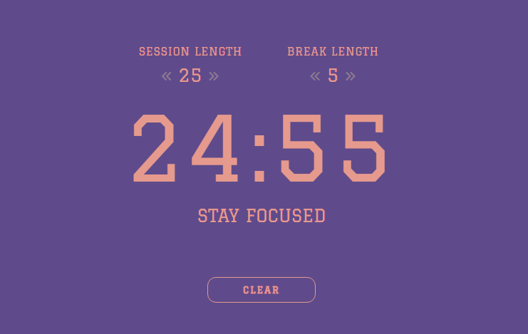

# Pomodoro Timer

A simple Pomodoro Timer built with HTML, CSS, and JavaScript. This project allows users to set focus and break times, start/stop the timer, and view the remaining time.

Check it out: [Pomodoro Timer](https://moaburke.github.io/PomodoroTimer/).

## Features

- Adjustable focus and break times
- Start and stop functionality
- UI updates during focus and break sessions
- Responsive design with Google Fonts and Font Awesome icons

## Project Structure

- `index.html`: The main HTML file containing the structure of the Pomodoro Timer.
- `style.css`: The external CSS file for styling the timer and buttons.
- `timer.js`: The external JavaScript file handling timer functionality and user interactions.

## Usage

1. **Adjust the session and break times:**
   - Use the left and right arrow buttons to decrease or increase the focus session and break times.
     - **Focus Session Length:** Adjust using the buttons under "Session Length."
     - **Break Length:** Adjust using the buttons under "Break Length."

2. **Start the timer:**
   - Click the **"Start"** button to begin the focus session. The timer will count down from the set focus time.

3. **Clear the timer:**
   - Click the **"Clear"** button to stop the timer and reset it to the initial focus time. The clear button will only be visible while the timer is running.

4. **View the timer display:**
   - The timer display shows the remaining minutes and seconds. When the focus session ends, the timer will switch to break mode.
   - During the break, the timer will count down from the set break time, and the interface will update to reflect the break mode.

5. **Timer States:**
   - **Focus Mode:** The timer counts down from the focus session length.
   - **Break Mode:** After the focus session ends, the timer switches to break mode and counts down from the break length.

## Dependencies

- **Font Awesome:** Provides icons used in the interface. [Font Awesome](https://fontawesome.com/)
- **Google Fonts:** Provides custom font styling. [Google Fonts](https://fonts.google.com/)
